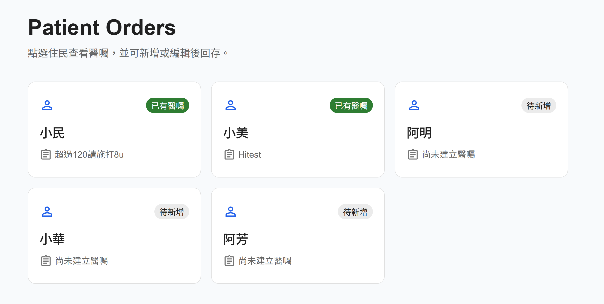
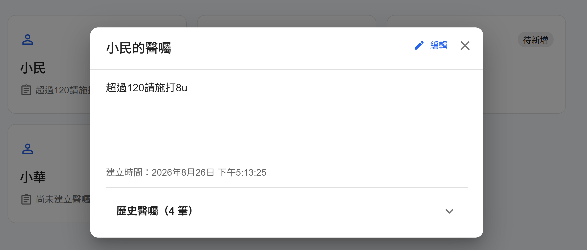
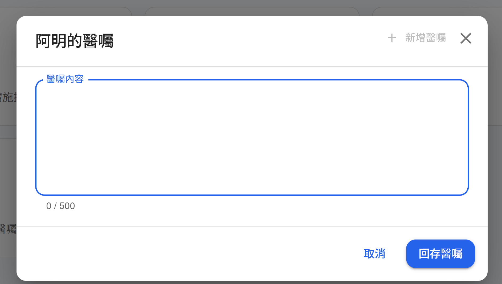
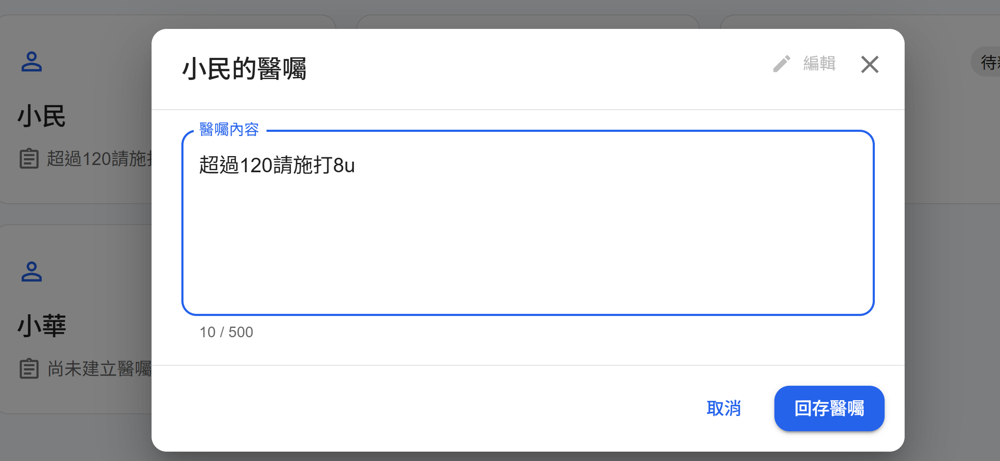
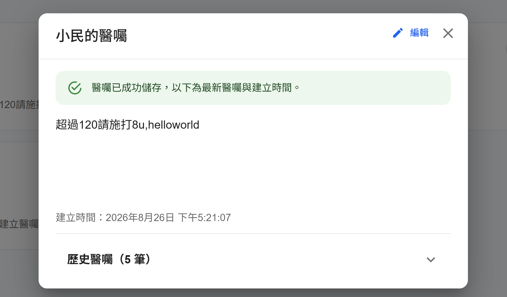

# Patient Order Assessment

以 **React (Next.js) + Material UI、Node.js + Express、PostgreSQL** 實作的 Patient／Order 技術前測專案。

## 功能畫面預覽

### 病人清單



### 查看目前醫囑與歷史版本



### 新增、編輯與儲存醫囑







## 功能

- 顯示固定 seed 的 5 位 Patient。
- 點選 Patient 後開啟 Dialog，查看目前最新的 Order 與建立時間。
- Dialog 右上角依資料狀態提供 **新增醫囑** 或 **編輯** 操作。
- 儲存修改時不會覆寫既有資料，而是建立一筆新的醫囑版本；儲存成功後立即顯示最新醫囑與時間。
- 唯讀模式提供預設收合的「歷史醫囑」列表，依建立日期／時間由新到舊排列。
- Order 可回存；前後端皆驗證內容不可空白、長度最多 500 字。
- 手機、平板與桌面 RWD：清單使用 `xs=12 / sm=6 / md=4`，Dialog 在窄螢幕維持可用邊界與大型點擊區。
- Express 採 route + repository 分層；資料庫使用 transaction 保護醫囑版本新增作業。

## 資料模型與題意解讀

本功能調整為病人與醫囑的一對多關係：

```text
Patient 1 ── 0..N Order
```

`orders.patient_id` 是外鍵。每次新增或修改都會新增一筆 `orders` 資料，既有醫囑不會被覆寫；依 `created_at DESC, id DESC` 的第一筆為目前最新醫囑，其餘即為歷史紀錄。

## 架構

```text
Browser
  └─ Next.js / React Hooks / MUI (3000)
       └─ REST API
            └─ Express (4000)
                 └─ PostgreSQL (5432, Docker internal)
```

## 本機開發（Docker Desktop 尚未可用時）

需要 Node `20.19.6`（專案 `.nvmrc` 已指定）。

```bash
nvm use
npm install
npm install --prefix backend
npm install --prefix frontend
npm run dev
```

前端：<http://localhost:3000>  
後端 health check：<http://localhost:4000/health>

> 後端須有可連線的 PostgreSQL；可從 `backend/.env.example` 建立 `backend/.env`，填入本機 `DATABASE_URL`。完整可重現資料庫與 seed 的推薦方式是下方 Docker Compose。

## Docker Compose（正式驗收流程）

前置：Docker Desktop → **Settings → Resources → WSL Integration** 啟用目前 WSL distro，並重開 WSL shell，確認 `docker --version` 有輸出。

```bash
docker compose up --build
```

首次建立 PostgreSQL volume 時會自動執行 `db/init.sql`，產生 5 位 Patient，且僅小民有 1 筆初始 Order；其餘病人可從 Dialog 新增醫囑。

> 已使用舊版 `patients.order_id` schema 的資料庫，請在部署新版後先執行 `db/migrations/001_patient_order_history.sql`。此 migration 會保留既有醫囑、補上 `orders.patient_id`，並移除舊的一對一關聯。

驗收後停止：

```bash
docker compose down
```

若要連資料一併重建 seed：

```bash
docker compose down -v
docker compose up --build
```

## API

- `GET /health`
- `GET /api/patients`
- `POST /api/patients/:patientId/orders` body: `{ "message": "..." }`
- `PUT /api/orders/:orderId` body: `{ "message": "..." }`（建立新的醫囑版本，不覆寫原資料）

回應錯誤使用適當 HTTP status：驗證失敗 `400`、不存在 `404`。

## 驗證

```bash
npm test
npm run lint
npm run build --prefix frontend
```
